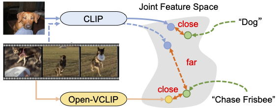

# Open-VCLIP: Transforming CLIP to an Open-vocabulary Video Model via Interpolated Weight Optimization

**This repository contains the official Pytorch implementation of our papers:**
- **"Open-VCLIP: Transforming CLIP to an Open-vocabulary Video Model via Interpolated Weight Optimization (ICML 2023, Poster)"** [[`Paper1`]](https://arxiv.org/abs/2302.00624)

  Zejia Weng, Xitong Yang, Ang Li,  Zuxuan Wu, Yu-Gang Jiang
- **"Building an Open-Vocabulary Video CLIP Model With Better Architectures, Optimization and Data (TPAMI 2024)"** [[`Paper2`]](https://ieeexplore.ieee.org/stamp/stamp.jsp?tp=&arnumber=10412661)

  Zuxuan Wu, Zejia Weng, Wujian Peng, Xitong Yang, Ang Li, Yu-Gang Jiang  


# Introduction

We introduce a simple yet effective approach, **Open-VCLIP**, which transforms CLIP into strong zero-shot video classifiers and can better recognize unseen actions and events at test time.
The extended version **Open-VCLIP++** is comming soon. The self-generated captions for Kinetics-400 have been uploaded in folder **"/blip\_llama2\_caption"**.

<div align=center>
  
</div>

# Dependency

The main dependent packages include: PyTorch 1.11.0 and torchvision 0.12.0 and [`PySlowFast`](https://github.com/facebookresearch/SlowFast)

Detailed Installation instruction can be viewed in [`INSTALL.md`](https://github.com/wengzejia1/Open-VCLIP/blob/main/INSTALL.md).

# Checkpoint

We upload the checkpoints of Open-VCLIP, which can be downloaded through the following links:

- checkpoint: [`https://drive.google.com/drive/folders/1VhwPFESkrr9Ed40yU5NEPIkrGIf6WQ9N?usp=share_link`](https://drive.google.com/drive/folders/1VhwPFESkrr9Ed40yU5NEPIkrGIf6WQ9N?usp=share_link)

# Data Preparation

- **Kinetics-400.** 

  We obtained the compressed version Kinetics-400 dataset, where videos have been resized to 256, from the [`VoV3d Repo`](https://github.com/youngwanLEE/VoV3D/blob/main/DATA.md#kinetics-400). The repository  provides the download link for the dataset:  [[`Kinetics-400 dataset link`](https://dl.dropbox.com/s/419u0zljf2brsbt/compress.tar.gz)]. After downloading and extracting the data, you should rename the folders "train_256" and "val_256" to "train" and "val" respectively. Additionally, please note that the video "val/crossing_river/ZVdAl-yh9m0.mp4" is invalid and needs to be replaced. You should download a new version of the video from [`here`](https://drive.google.com/file/d/15M07kKQlZEoVzUezppITSnICs83fch8A/view?usp=share_link) and perform the replacement.

- **UCF-101.**

  We download UCF-101 dataset by the [`script`](https://github.com/open-mmlab/mmaction2/blob/main/tools/data/ucf101/download_videos.sh) provided by MMAction2.

- **HMDB-51.**

  We donwload HMDB-51 dataset by the [`script`](https://github.com/open-mmlab/mmaction2/blob/main/tools/data/hmdb51/download_videos.sh) provided by MMAction2.

- **Kinetics-600 testing.**

  Validation data of Kinetics-600 we used can be donwloaded from [`link`](https://pan.baidu.com/s/1d6wI-n3igMdE1rJ2xP2MsA?pwd=c5mu ).

# Training

Training scripts of OpenVCLIP are provided in **/script/training**. An example script can be viewed bellow. After that, you can run **weight_average.py** to perform the SWA operations.

```bash
ROOT=/PATH/TO/Open-VCLIP
CKPT=/PATH/FOR/SAVING/CKPT/
cd $ROOT

# DATA.PATH_PREFIX   # need to replace with the path of the dataset
# TRAIN.CLIP_ORI_PATH # need to replace with the path of CLIP weights
# MODEL.TEMPORAL_MODELING_TYPE # selection of temporal modeling module

python -W ignore -u tools/run_net.py \
  --cfg configs/Kinetics/TemporalCLIP_vitb16_8x16_STAdapter.yaml \
  --opts DATA.PATH_TO_DATA_DIR $ROOT/label_db/weng_compress_full_splits \
  DATA.PATH_PREFIX /dev/shm/k400 \
  DATA.PATH_LABEL_SEPARATOR , \
  DATA.INDEX_LABEL_MAPPING_FILE $ROOT/label_db/k400-index2cls.json \
  TRAIN.ENABLE True \
  OUTPUT_DIR $CKPT/basetraining/temporalclip_vitb16_8x16_interpolation_bugfix_0.5ratio_rand0.0_0.6sample \
  TRAIN.BATCH_SIZE 64 \
  TEST.BATCH_SIZE 240 \
  TEST.NUM_ENSEMBLE_VIEWS 3 \
  TEST.NUM_SPATIAL_CROPS 1 \
  NUM_GPUS 8 \
  SOLVER.MAX_EPOCH 22 \
  SOLVER.WARMUP_EPOCHS 2.0 \
  SOLVER.BASE_LR 3.33e-6 \
  SOLVER.WARMUP_START_LR 3.33e-8 \
  SOLVER.COSINE_END_LR 3.33e-8 \
  TRAIN.MIXED_PRECISION True \
  DATA.DECODING_BACKEND "pyav" \
  MODEL.NUM_CLASSES 400 \
  MODEL.TEMPORAL_MODELING_TYPE 'expand_temporal_view' \
  MIXUP.ENABLE False \
  AUG.ENABLE False \
  AUG.NUM_SAMPLE 1 \
  TRAIN.EVAL_PERIOD 1 \
  TRAIN.CHECKPOINT_PERIOD 1 \
  MODEL.LOSS_FUNC soft_cross_entropy \
  TRAIN.LINEAR_CONNECT_CLIMB True \
  TRAIN.CLIP_ORI_PATH ~/.cache/clip/ViT-B-16.pt \
  TRAIN.LINEAR_CONNECT_LOSS_RATIO 0.5 \
  TRAIN.LINEAR_CONNECT_SAMPLE_L 0.0 \
  TRAIN.LINEAR_CONNECT_SAMPLE_R 0.6 \
```

# Evaluation

Download [checkpoints](https://drive.google.com/drive/folders/1VhwPFESkrr9Ed40yU5NEPIkrGIf6WQ9N?usp=share_link) and evaluate models by scripts in folder **"/script/testing/"**.  An example script can be viewed bellow. 

#### Example: Testing on UCF-101 (B/16)

Note: Changing the value of **TEST.PATCHING_RATIO** will change the weight interpolation factors.

```bash
ROOT=/PATH/TO/Open-VCLIP
CKPT=/PATH/FOR/SAVING/CKPT/
OUT_DIR=$CKPT/testing

LOAD_CKPT_FILE=/PATH/TO/openvclip-b16/swa_2_22.pth
PATCHING_RATIO=0.5

# DATA.PATH_TO_DATA_DIR $ROOT/zs_label_db/ucf101_full \ # option: ucf101full / ucf101_split1 / ucf101_split2 / ucf101_split3 / 
# DATA.PATH_PREFIX      # need to replace with the path of the dataset
# TEST.CUSTOM_LOAD_FILE # path of checkpoint to be loaded
# TEST.PATCHING_RATIO   # relates to the patching ratio: [old_w * ratio + new_w * (1 - ratio)]
# TEST.CLIP_ORI_PATH    # need to replace with the path of CLIP weights
# MODEL.TEMPORAL_MODELING_TYPE # selection of temporal modeling module

cd $ROOT
python -W ignore -u tools/run_net.py \
    --cfg configs/Kinetics/TemporalCLIP_vitb16_8x16_STAdapter.yaml \
    --opts DATA.PATH_TO_DATA_DIR $ROOT/zs_label_db/ucf101_full \
    DATA.PATH_PREFIX /dev/shm/ucf/UCF-101 \
    DATA.PATH_LABEL_SEPARATOR , \
    DATA.INDEX_LABEL_MAPPING_FILE $ROOT/zs_label_db/ucf101-index2cls.json \
    TRAIN.ENABLE False \
    OUTPUT_DIR $OUT_DIR \
    TEST.BATCH_SIZE 480 \
    NUM_GPUS 8 \
    DATA.DECODING_BACKEND "pyav" \
    MODEL.NUM_CLASSES 101 \
    MODEL.TEMPORAL_MODELING_TYPE 'expand_temporal_view'
    TEST.CUSTOM_LOAD True \
    TEST.CUSTOM_LOAD_FILE $LOAD_CKPT_FILE \
    TEST.SAVE_RESULTS_PATH temp.pyth \
    TEST.NUM_ENSEMBLE_VIEWS 3 \
    TEST.NUM_SPATIAL_CROPS 1 \
    TEST.PATCHING_MODEL True \
    TEST.PATCHING_RATIO $PATCHING_RATIO \
    TEST.CLIP_ORI_PATH /root/.cache/clip/ViT-B-16.pt \
```

# Acknowledgement

This repository is built upon [`PySlowFast`](https://github.com/facebookresearch/SlowFast) and [`CLIP`](https://github.com/openai/CLIP). Thanks for those well-organized codebases.

# Citation

```
@inproceedings{weng2023transforming,
  title={Open-VCLIP: Transforming CLIP to an Open-vocabulary Video Model via Interpolated Weight Optimization},
  author={Weng, Zejia and Yang, Xitong and Li, Ang and Wu, Zuxuan and Jiang, Yu-Gang},
  booktitle={ICML},
  year={2023}
}

@article{wu2024building,
  title={Building an Open-Vocabulary Video CLIP Model With Better Architectures, Optimization and Data},
  author={Wu, Zuxuan and Weng, Zejia and Peng, Wujian and Yang, Xitong and Li, Ang and Davis, Larry S and Jiang, Yu-Gang},
  journal={TPAMI},
  year={2024},
}
```
